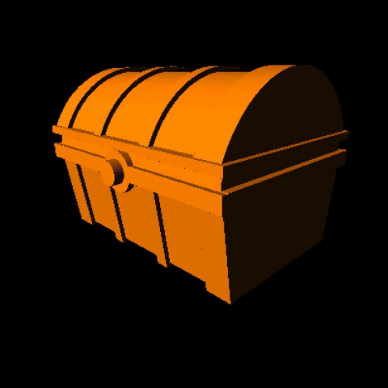

# Le Chest - Homework 2

[Demo URL](https://vasumahesh1.github.io/homework-2-implicit-surfaces-vasumahesh1/)

## Timelapse

## Important Notes

This wont run on my Mac. It probably crashes because the file is pretty big and the instructions generated are way too much for the gpu to handle. Make sure you have a decent graphic card to run this. (For a reference I completed this on a 970 gtx).

I have fixed the resolution to 600x600, get somewhere around 30-50 fps.

## Stuff in this homework

### SDFs

Mostly a bunch of the basic shapes as available in IQ's website. Most of the SDF functions like Union, Sub, Intersect are used.

---

### Animation

##### Fake Wind

I animated the bend of the Flag right next to the chest to make the scene look as if there is wind flowing through. So the Bend of the flag varies based on the Y of the flag, I offset the flag so that the top of the flag barely moves, ever so slightly.

##### Chest Open / Close

There is a control to open and close the chest. I wanted to put a banana in the chest, but ran out of time :3

##### Clouds

I added a 2D fbm'ed noise and used that to create cloud animation effect, it was a minor change, but it adds a good amount of life to the scene.

---

### The Terrain (Ray Marching Height Fields)

The terrain is just random hash based noise, that is fbm'ed over some octaves. I do have some boundary conditions so I generate only the noise I need. This scene particularly has a noise that is generated only for a radius. I scaled the noise so that it looks mountainous and the origin is where the chest is. So I had some form of a "lerp" so force the mountain terrain to lower its height such that it creates a scene where I have a chest and lots of rocks in the background. More like a ditch was created.

When I started raymarching the scene got so laggy with around 17fps for 400x400 pixels. For that I made some optimizations after talking to Dan and Joe. (listed in Optimizations)

---

### Environment Map based Reflections & Skybox

I used an env map to produce reflections on Gold and Silver like materials. I used another random sky image to generate the skybox.

---

### Tone Mapping & Gamma Correction 

I made some color correction so that my scene wasn't dull. You can see such a change in the Process GIF.

---

### Soft Shadows

Another thing stolen from IQ, I used the article's reference code to generate some shadows for the flag, pole and chest.

---

### Music

I used music from [Vindsvept](https://www.youtube.com/channel/UCfSUheoljDlGDjerRylO4Nw). I felt adding some fantasy music would be good!

---

### Terrain Texture Baking & Ray Marching Optimizations

I optimized my terrain by baking my noise into a texture. I used that texture after that to render my height field. For Ray Marching, there is a bounding box in the middle containing the Scene's SDF. I ray trace that bounding box and then decide if it is suitable to ray marching it or not.

This is what my noise looks like, as you can see I have a sphere boundary condition on it so I don't query height fields that I don't need for my scene. One good thing that i could have done (but didn't do) was to make the Camera restricted in the zone.

---

### Removing excess function calls & reducing calculations

I tried to do this, But I felt baking the terrain was more important. Currently, the only issue you might encounter is loading the GLSL file to the gpu. Once loaded it runs really well.

